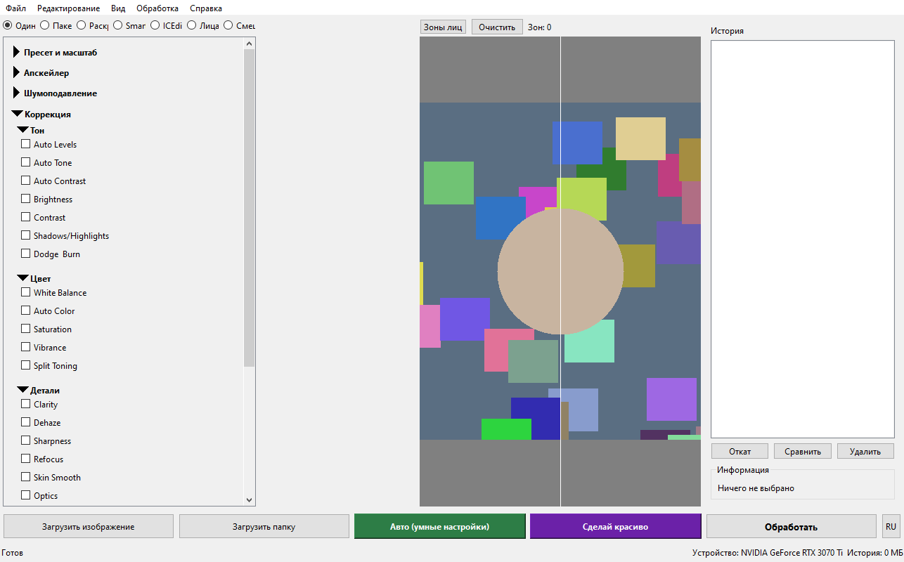
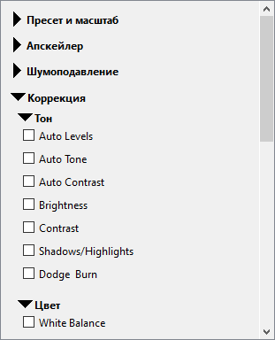
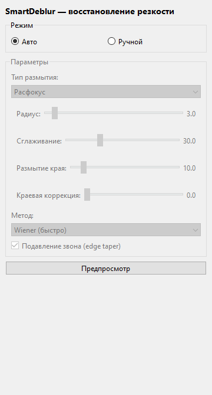
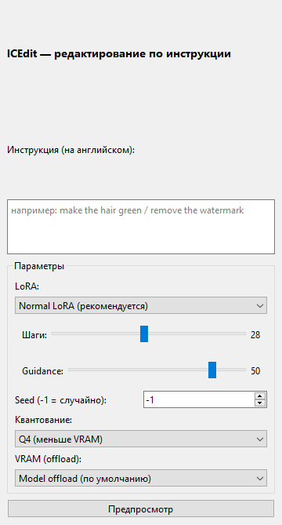
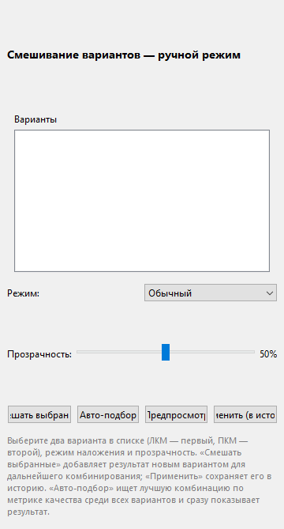
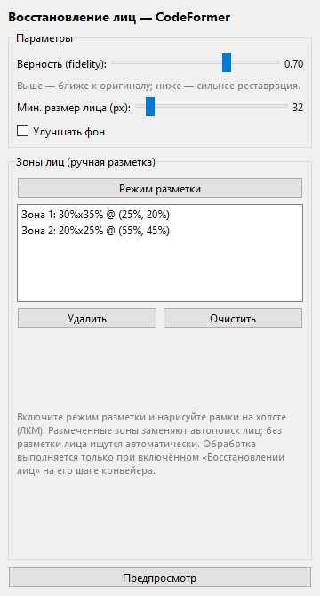
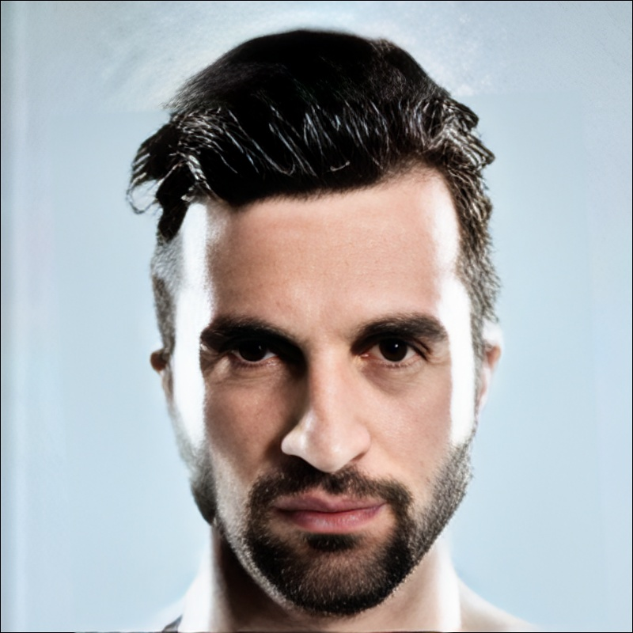
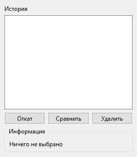

# Upscaler

[English](README.en.md) | **Русский**

Профессиональное приложение для увеличения и улучшения изображений с ИИ-моделями, традиционными алгоритмами и полным конвейером обработки.

## От автора

Я делал этот проект для себя. Мне хотелось иметь один инструмент, который
объединяет современные ИИ-апскейлеры, шумоподавление, деблюр, восстановление
лиц, раскрашивание и «фотошопную» коррекцию — с автоматическим подбором
параметров, чтобы не крутить десяток ползунков вручную. Отсюда и такой
широкий, местами избыточный набор возможностей: это именно те вещи, которые
были нужны мне в реальной работе с фотографиями. Наигравшись, я решил
поделиться проектом со всеми — вдруг он окажется полезен и вам.

Проект сознательно рассчитан на работу **даже на скромном железе** (мини-ПК,
ноутбук без дискретной видеокарты): почти всё работает на CPU, а тяжёлые
ИИ-модели — опциональны (см. [«Запуск на мини-ПК»](#запуск-на-мини-пк)).

## Возможности

- **11 методов увеличения** — 5 ИИ (Real-ESRGAN, HAT-S, SwinIR, OmniSR, DAT) + 6 традиционных (Lanczos, Bicubic, Sinc, NEDI, DCCI, EGGI/SIRE)
- **6 шумоподавителей** — 2 ИИ (SCUNet, NAFNet) + 4 традиционных (BM3D, NL-Means, Bilateral, Wavelet)
- **7 корректоров** — Auto Contrast, Auto Tone, Auto Color, Brightness, Contrast, Saturation, Sharpness
- **3 колоризатора** — DDColor (фото), DeOldify (фото и видео), ColorMNet (фото и видео)
- **SmartDeblur** — восстановление расфокусированных и смазанных изображений деконволюцией (Wiener / Tikhonov / Total Variation) с автоматической слепой оценкой параметров
- **ICEdit** — редактирование изображения по инструкции на естественном языке (FLUX.1-Fill-dev GGUF + LoRA); достаточно описать желаемое изменение текстом
- **Восстановление лиц (CodeFormer)**: автоматическое улучшение лиц на портретах.
- **Чекбокс «ИИ-ассистент»**: отключает vision-модель и переключает авто-кнопки на алгоритмический подбор.
- **Масштабы** — 2x, 4x, 8x, 16x и режим «только улучшение»
- **Авто-уменьшение мыльных изображений** — если разрешение номинально высокое, а реальной детализации меньше (апсемпл), авто-режим сначала уменьшает изображение до эффективного разрешения (оценка по спектру), затем обрабатывает как обычно. Отключается чекбоксом в группе «Масштаб».
- **Смешивание вариантов** — авто-фича: промежуточные варианты обработки накладываются друг на друга (25 режимов Photoshop, подбор режима и прозрачности по метрике качества); включается чекбоксом «Смешивание вариантов».
- **Холст до/после** — Разделённый вид с перетаскиваемым разделителем, зум и панорамирование
- **7 встроенных пресетов** — Photo Realistic, Anime/Art, Text/Document, Maximum Quality, Fast Preview, Enhance Only, Archival Restore
- **Пакетная обработка** — Обработка целых папок с обработкой ошибок для каждого файла
- **История версий** — На диске с миниатюрами, откатом, сравнением и восстановлением сессии
- **Метрики качества** — BRISQUE, NIQE, гистограмма, детекция артефактов
- **GPU-ускорение** — CUDA с автоматическим откатом на CPU, тайловый инференс для больших изображений

## Скриншоты

| | |
|---|---|
|  **Главное окно** — холст до/после, левая панель управления, история версий справа |  **Коррекция** — сворачиваемые секции: тон, цвет, детали |
|  **SmartDeblur** — ручная деконволюция с предпросмотром |  **ICEdit** — правка по текстовой инструкции |
|  **Смешивание** — список вариантов + 25 режимов наложения |  **Лица** — ручная разметка зон для CodeFormer |
|  **Размытое изображение** |  **Восстановленное изображение** |
|  **История** — версии с миниатюрами, откат и сравнение | |

## Запуск на мини-ПК

Приложение изначально проектировалось так, чтобы быть **полезным даже без
мощной видеокарты** — на мини-ПК, тонком ноутбуке или офисной машине.

- **Всё ядро работает на CPU.** Традиционные апскейлеры (Lanczos, Bicubic,
  Sinc, NEDI, DCCI, EGGI/SIRE), все шумоподавители кроме нейросетевых,
  корректоры («фотошопная» коррекция), SmartDeblur (FFT-деконволюция) и вся
  аналитика/метрики построены на numpy/OpenCV/scipy и не требуют GPU.
- **ИИ-модели опциональны.** Нейросетевые апскейлеры, колоризаторы,
  восстановление лиц, ICEdit и ИИ-ассистент — по желанию. Не установили их
  веса/зависимости — соответствующие шаги просто пропускаются, приложение
  продолжает работать.
- **Скромный расход памяти по умолчанию.** Обработка идёт тайлами с
  перекрытием, поэтому большие изображения не требуют держать всё в памяти
  целиком. Размер тайла настраивается (`tile_size`) — на слабой машине его
  можно уменьшить.
- **Устойчивость к нехватке ресурсов.** При нехватке VRAM размер тайла
  автоматически уменьшается, а затем происходит прозрачный откат на CPU —
  без падения и без ошибок для пользователя.
- **Один исполняемый файл.** Можно собрать standalone `.exe` (PyInstaller,
  CPU-вариант PyTorch даёт компактную сборку) — конечному пользователю не
  нужно ничего устанавливать. См. [«Сборка»](#сборка-в-самостоятельное-приложение-exe).

Практический сценарий: на мини-ПК без дискретной видеокарты используйте
традиционные апскейлеры + шумоподавление + коррекцию + SmartDeblur — это уже
даёт заметное улучшение фотографий полностью на CPU. Нейросетевые модели
подключайте по мере наличия ресурсов.

## Поддерживаемые форматы

| Вход | Выход |
|------|-------|
| PNG, JPEG, TIFF, BMP, WebP | PNG (8-bit) |
| OpenEXR, Radiance HDR | TIFF (16-bit) |
| RAW (CR2, NEF, ARW) | OpenEXR (32-bit float) |

## Установка

### Автоматическая (рекомендуется)

Скрипты создают окружение `.venv` на Python 3.10 и ставят всё: PyTorch,
зависимости из `requirements.txt` и `llama-cpp-python` (для LLM-советника).
При отсутствии Python 3.10 — устанавливают его (Windows: winget; Linux/macOS:
pyenv/системный пакет).

С флагом CUDA скрипты ставят **все работающие с GPU библиотеки** в CUDA-варианте:
PyTorch, `llama-cpp-python` (LLM/vision-советник), `onnxruntime-gpu` (CodeFormer)
и стек ICEdit (diffusers и др.), затем печатают проверку доступности GPU. Тег
CUDA по умолчанию — `cu124` (валиден и для индекса PyTorch, и для llama-cpp).

**Windows (PowerShell):**
```powershell
.\install.ps1                          # CPU-сборки
.\install.ps1 -Cuda                    # все GPU-библиотеки (cu124)
.\install.ps1 -Cuda -CudaVersion cu121 # другой тег CUDA
```

**Linux/macOS:**
```bash
./install.sh                       # CPU
./install.sh --cuda                # все GPU-библиотеки (cu124)
CUDA_VERSION=cu121 ./install.sh --cuda
```

> Важно: обычный `pip install llama-cpp-python` ставит **CPU-сборку**, поэтому
> `-Cuda` принудительно заменяет её на CUDA-колесо (`--force-reinstall
> --prefer-binary`). Если LLM-ассистент работает на CPU после установки —
> убедитесь, что запускаете приложение из `.venv`, и проверьте вывод шага
> «Проверка доступности GPU».

### Вручную

```bash
pip install -r requirements.txt
# опционально для LLM-советника:
pip install "llama-cpp-python>=0.3"
```

### Требования

- Python 3.10+
- PySide6 >= 6.6
- PyTorch >= 2.5 (с CUDA для GPU-ускорения)
- OpenCV, NumPy, Pillow, scipy, scikit-image, spandrel, safetensors

Опциональные (для отдельных плагинов):
- `bm3d >= 4.0` — BM3D шумоподавитель
- `PyWavelets >= 1.5` — Wavelet шумоподавитель
- `rawpy >= 0.19` — Поддержка RAW файлов камер
- `OpenEXR >= 3.2` — Поддержка формата EXR
- `onnxruntime >= 1.16` — Восстановление лиц (CodeFormer-ONNX); без него шаг пропускается. Для GPU: `onnxruntime-gpu`.

## Максимальное использование GPU

Приложение задействует видеокарту везде, где это возможно, но **разные части
используют разные рантаймы**, и каждый из них нужно поставить в CUDA-варианте.
Обычная установка пакетов ставит CPU-сборки `llama-cpp-python` и `onnxruntime` —
тогда соответствующие шаги молча работают на CPU. Ниже — как включить GPU
по максимуму.

### Что и за счёт чего ускоряется

| Компонент | Рантайм для GPU | Что поставить |
|-----------|-----------------|---------------|
| ИИ-апскейлеры, шумоподавители, колоризаторы | **PyTorch + CUDA** | CUDA-сборка `torch` |
| SmartDeblur (FFT-деконволюция Wiener/Tikhonov/TV/RL) | **PyTorch + CUDA** (`torch.fft`) | CUDA-сборка `torch` |
| ИИ-ассистент (LLM + vision/CLIP) | **llama-cpp-python с CUDA** | CUDA-колесо `llama-cpp-python` |
| Восстановление лиц (CodeFormer-ONNX) | **onnxruntime-gpu** | `onnxruntime-gpu` |
| ICEdit (FLUX.1-Fill-dev) | **PyTorch + CUDA** (diffusers) | CUDA-`torch` + стек diffusers |
| Детекция лиц (YuNet, OpenCV) | — (CPU) | лёгкий шаг, GPU не нужен |

### Шаг 1. Единственная настройка — `gpu_device`

В `~/.upscaler/settings.json` (или меню «Настройки») параметр `gpu_device`:

- `"auto"` (по умолчанию) — использовать CUDA, если доступна, иначе CPU. **Это
  и есть режим «максимум GPU».**
- `"cuda:0"` — принудительно конкретная видеокарта.
- `"cpu"` — принудительно CPU (в т.ч. ИИ-ассистент не выгружается на GPU).

Никаких других переключателей не нужно: при `"auto"`/`"cuda:*"` все torch-модели
переносятся на GPU (FP16-автокаст, тайловый инференс, автоподбор размера тайла),
а ИИ-ассистент выгружает на видеокарту все слои модели (`n_gpu_layers=-1`).

### Шаг 2. Поставить CUDA-сборки рантаймов

Подберите тег `cuXXX` под версию вашего CUDA-драйвера (например `cu121`, `cu124`,
`cu125`). Команды (в активированном окружении проекта):

```bash
# 1) PyTorch с CUDA (ИИ-модели, SmartDeblur, ICEdit) — см. также install.ps1 -Cuda и BUILD.md
pip install --force-reinstall torch --index-url https://download.pytorch.org/whl/cu124

# 2) llama-cpp-python с CUDA (ИИ-ассистент: LLM + vision-модель)
pip install --force-reinstall --no-cache-dir llama-cpp-python \
    --extra-index-url https://abetlen.github.io/llama-cpp-python/whl/cu125

# 3) onnxruntime-gpu (восстановление лиц CodeFormer)
pip install onnxruntime-gpu

# 4) Стек ICEdit (использует CUDA-torch из п.1)
pip install diffusers transformers accelerate peft gguf sentencepiece protobuf
```

> Обычный `pip install llama-cpp-python` и `pip install onnxruntime` ставят
> **CPU-сборки** — для GPU обязательны именно CUDA-колесо llama и пакет
> `onnxruntime-gpu`. Если CUDA-колеса llama для вашего тега нет — поставьте
> ближайший младший (драйверы CUDA обратно совместимы).

### Шаг 3. Проверить, что GPU реально задействован

```bash
# PyTorch видит CUDA:
python -c "import torch; print('torch CUDA:', torch.cuda.is_available(), torch.cuda.get_device_name(0))"

# llama-cpp собран с GPU-выгрузкой:
python -c "import llama_cpp; print('llama GPU offload:', llama_cpp.llama_cpp.llama_supports_gpu_offload())"

# onnxruntime имеет CUDA-провайдер:
python -c "import onnxruntime as o; print(o.get_available_providers())"  # должен быть CUDAExecutionProvider
```

Дополнительно:

- В **строке состояния** приложения показывается имя активного устройства
  (например `Устройство: NVIDIA GeForce RTX 3070 Ti`).
- В логах при запуске ИИ-ассистента llama печатает строку вида
  `load_tensors: offloaded 36/36 layers to GPU` — это подтверждает выгрузку на
  видеокарту. Логи: `~/.upscaler/upscaler.log`.
- На Windows (WDDM) `nvidia-smi --query-compute-apps` часто **не** показывает
  процессы — это не признак работы на CPU, ориентируйтесь на строку `offloaded`.

### VRAM и устойчивость

- Тайловый инференс автоматически подбирает размер тайла под свободную VRAM;
  при OOM тайл уменьшается вдвое (до 2 попыток), затем — прозрачный откат на CPU.
- FP16-автокаст ускоряет инференс; при появлении NaN/мусора — авто-повтор в FP32.
- Ориентиры по VRAM: апскейлеры ~0.35–0.5 ГБ, колоризаторы ~0.6–0.9 ГБ,
  ИИ-ассистент (gemma/qwen ~4B Q5 + vision) ~4–5 ГБ, ICEdit ~6–8 ГБ.
- Если видеокарты не хватает на всё сразу — это не проблема: компоненты грузятся
  по очереди и выгружаются после использования.

## Запуск

```bash
python run.py
```

или

```bash
python -m upscaler.main
```

## Сборка в самостоятельное приложение (.exe)

Проект собирается в самостоятельный исполняемый файл через PyInstaller — Python
и зависимости при этом устанавливать конечному пользователю не нужно.

**Быстрый способ — скрипт `build.py`** (проверяет зависимости и модели, прогоняет
тесты, затем запускает PyInstaller):

```bash
pip install pyinstaller          # один раз
python build.py                  # папка dist/Upscaler/ (рекомендуется)
python build.py --onefile        # один файл dist/Upscaler.exe (медленнее стартует)
python build.py --no-models      # не вкладывать ИИ-модели в сборку
python build.py --clean          # очистить артефакты предыдущей сборки
```

Скрипт сам обнаруживает все плагины (`--hidden-import`), собирает `torch` и
`spandrel` целиком (`--collect-all`) и вкладывает локальные модели из
`upscaler/models/models/`. Результат — `dist/Upscaler/Upscaler.exe`.

Размер сборки определяется тем, какой PyTorch установлен: CPU-вариант даёт
сборку в несколько раз меньше, чем CUDA. Какой колёсный пакет PyTorch ставить
для CPU- или GPU-сборки — см. [BUILD.md](BUILD.md) (варианты A/B).

Подробная пошаговая инструкция (системные требования, установка CUDA/CPU-варианта
PyTorch, предварительная загрузка моделей, ручная команда PyInstaller, размеры
сборки и решение типичных проблем) — в [BUILD.md](BUILD.md).

Приложение открывает окно с тремя панелями:

- **Левая панель** — Загрузка, выбор пресета, масштаб, галочки плагинов, ползунки параметров, кнопка обработки. Секции сворачиваются/разворачиваются кликом по заголовку (состояние запоминается между запусками), комбо-бокс выбора апскейлер-модели заменяет прежний список галочек. Группа «Порядок обработки» позволяет перетаскиванием задать последовательность применения шагов конвейера (кнопка «Сброс» возвращает автоматический порядок). Переключение между одиночным и пакетным режимом.
- **Центр** — Тулбар «Зоны лиц» над холстом (режим разметки, «Очистить», счётчик «Зон: N» — синхронизирован с вкладкой «Лица») и холст до/после с разделителем. Перетаскивайте разделитель, прокручивайте для зума, зажимайте для панорамирования.
- **Правая панель** — История версий с миниатюрами. Откат, сравнение или удаление любой версии.

Кнопка **RU/EN** справа от кнопки «Обработать» мгновенно переключает язык интерфейса (меню, панели, статус-бар, диалоги) без перезапуска приложения; выбор языка запоминается между запусками.

### Вкладка «Раскрашивание»

Отдельная вкладка для раскрашивания чёрно-белых фотографий и видео:

| Модель | Тип | Варианты | VRAM |
|--------|-----|----------|------|
| DDColor | Фото | Artistic, ModelScope | ~900 МБ |
| DeOldify | Фото + видео | Stable, Artistic, Video | ~600 МБ |
| ColorMNet | Фото + видео | — | ~700 МБ |

### Вкладка «SmartDeblur»

Восстановление расфокусированных и смазанных изображений методом деконволюции
(порт алгоритмов SmartDeblur на numpy/scipy). Галочка **«SmartDeblur»** в группе
«Восстановление» левой панели включает авто-режим: тип размытия, радиус, угол
смаза и регуляризация оцениваются автоматически (слепая оценка по кепстру
спектра и форме радиального спектра). Деблюр также включается автоматически
кнопкой «Авто», если обнаружено заметное размытие.

Вкладка **«SmartDeblur»** даёт ручную настройку с предпросмотром:

| Параметр | Назначение |
|----------|------------|
| Тип размытия | Расфокус (диск) / Смаз (движение) / Гаусс |
| Радиус | Размер ядра размытия |
| Угол | Направление смаза (для движения) |
| Сглаживание | Регуляризация (подавление шума и звона) |
| Размытие края / Краевая коррекция | Тонкая настройка ядра расфокуса |
| Метод | Wiener (быстро) / Tikhonov / Total Variation / Richardson-Lucy |
| Итерации | Число итераций для TV и Richardson-Lucy |
| Подавление звона | Edge taper — блендинг границ для устранения звона FFT |

Деблюр выполняется в стадии предобработки, до увеличения (деконволюция на
нативном разрешении). Подавление звона (edge taper) и метод Richardson-Lucy
реализованы по материалам статей о SmartDeblur.

### Вкладка «ICEdit»

Редактирование изображения по инструкции на естественном языке (In-Context
Edit). Достаточно описать желаемое изменение — например «make the hair green»
или «remove the watermark» — и ICEdit применит правку. Используется
квантованная FLUX.1-Fill-dev (GGUF, ~6–8 ГБ) + LoRA (`Normal` по умолчанию;
`MoE` — экспериментально: её веса отозваны автором ICEdit, а формат требует
кастомного кода и не поддерживается стандартной загрузкой diffusers).

Чекбокс «ICEdit» в группе «Редактирование» левой панели разрешает
vision-модели самой решать, нужна ли правка, и формулировать инструкцию (при
снятом чекбоксе ICEdit не учитывается вовсе). На вкладке «ICEdit» можно ввести
инструкцию вручную, выбрать LoRA, число шагов, seed, режим квантования и
offload, и нажать «Предпросмотр».

Требования: GPU с ~6–8 ГБ VRAM (по умолчанию `model` offload); первый запуск
скачивает веса (~7–9 ГБ суммарно). Зависимости: diffusers, transformers,
accelerate, peft, gguf. Без них/без весов ICEdit просто пропускается.
Параметры по умолчанию соответствуют официальному инференсу ICEdit: guidance 50,
28 шагов; если правка не применяется — смотрите лог: загрузка LoRA теперь
проверяется и о сбое сообщается явно.

### Вкладка «Смешивание»

Список вариантов на вкладке формируется автоматически из снимков шагов
конвейера ТЕКУЩЕГО прогона обработки (каждый изменивший изображение шаг —
свой вариант, с подписью-названием шага); список сбрасывается и наполняется
заново при каждом запуске обработки («Обработать» / «Сделать красиво»), так
что вкладка всегда отражает только текущий прогон, а не варианты из прошлого.

Выбор двух вариантов в списке (первый/второй, как в истории) сразу показывает
их сравнение на холсте (до/после). Кнопка «Смешать выбранные» смешивает
первый вариант как базу и второй как накладываемый слой (режим наложения из
25 режимов Photoshop: от Multiply/Screen/Overlay до компонентных
Hue/Saturation/Color/Luminosity, плюс прозрачность) — результат сразу
показывается на холсте и добавляется в список вариантов новым пунктом, чтобы
его можно было использовать в дальнейшем смешивании. «Предпросмотр» показывает
результат на холсте без сохранения; «Применить» сохраняет его уже новой
версией постоянной истории. Кнопка «Авто-подбор» строит рецепт автоматически
по метрике качества (резкость, контраст, насыщенность, экспозиция, шум) по
всем накопленным вариантам, сразу показывает результат на холсте и тоже
добавляет его вариантом.

Авто-режим той же фичи включается чекбоксом «Смешивание вариантов» в панели
«Одиночный»: тогда конвейер сам собирает промежуточные варианты и, если
наложение улучшает метрику, применяет лучший рецепт последним шагом (в том
числе в итерациях доработки). Оценка кандидатов выполняется алгоритмической
метрикой качества в обоих режимах работы ИИ-ассистента.

### Восстановление лиц (CodeFormer)

Если на изображении есть лица, в авто-режиме включается CodeFormer: лица
детектируются (YuNet), выравниваются и восстанавливаются нейросетью, затем мягко
вклеиваются обратно. Чекбокс «Восстановление лиц» в группе «Восстановление» и
вкладка «Лица» (слайдер «Верность», «Улучшать фон») управляют процессом.
Выполняется после увеличения. Требуется `onnxruntime` (опционально); без него шаг
пропускается. Веса CodeFormer (~360 МБ) и детектор YuNet (~340 КБ) скачиваются по
требованию, когда настроен рабочий источник; если источник недоступен или
`onnxruntime` не установлен — шаг пропускается без ошибок.

Зоны лиц можно разметить вручную: на вкладке «Лица» включите «Режим
разметки» и нарисуйте рамки на холсте (перемещение и ресайз за углы, поворот
за маркер, Delete — удалить). Размеченные зоны заменяют автодетекцию и
обрабатываются CodeFormer
на его шаге конвейера; кнопки «Удалить»/«Очистить» управляют списком зон.

### ИИ-ассистент (vision-модель)

Чекбокс «ИИ-ассистент» включает/выключает vision-модель. Когда выключен,
автоматические кнопки используют только алгоритмический подбор параметров
(`AutoConfigurator`) и не запускают итеративную переоценку результата.

### Автоматический подбор параметров (LLM-советник)

Кнопки **«Авто»** и **«Сделай красиво»** сначала рассчитывают параметры
обработки алгоритмически (`AutoConfigurator` по метрикам `SourceAnalyzer`).
Если включена настройка `use_llm_advisor` и доступна локальная GGUF-модель
(`upscaler/models/models/`), эти параметры вместе с описанием изображения
передаются модели, которая возвращает уточнённый JSON параметров под конкретное
содержимое снимка. Модель может задать **весь набор параметров обработки**:
масштаб, апскейлер, шумоподавитель и его силу, корректоры (Auto Tone/Contrast/
Color, яркость/контраст/насыщенность/резкость), резкость/рефокус постобработки и
**полный блок SmartDeblur** (тип размытия, радиус, угол, сглаживание, edge
feather, краевая коррекция, метод, итерации, edge taper). Параметры деблюра для
кнопок «Авто»/«Сделай красиво» рассчитываются через модель и отражаются на
вкладке «SmartDeblur». Результат валидируется, ограничивается безопасными
диапазонами и накладывается поверх алгоритмического конфига. Инференс выполняется
в отдельном потоке (QThread), не блокируя интерфейс.

Модель получает изображение напрямую, если установлен мультимодальный рантайм
(`llama-cpp-python`) **и** присутствует mmproj-файл (vision-проектор); иначе
используется подробное текстовое описание метрик изображения. При отсутствии
рантайма/модели или любой ошибке — прозрачный откат на алгоритмический режим.

Установка (опционально): `pip install "llama-cpp-python>=0.3"` и размещение
GGUF-модели в `upscaler/models/models/`. Чтобы ИИ-ассистент работал на
видеокарте, нужна **CUDA-сборка** `llama-cpp-python` — см.
[«Максимальное использование GPU»](#максимальное-использование-gpu).

### Итеративная доработка (агентный режим)

После обработки vision-модель снова смотрит на результат и оценивает его. Если
его можно улучшить, она формирует новый конвейер доработки (без повторного
масштабирования) и применяет его к полученному изображению — и так до заданного
максимума конвейеров суммарно. Каждая итерация сохраняется в истории отдельной
записью.
Работает в «Сделай красиво» и «Обработать», когда включён ИИ-советник.
Максимальное число повторных обработок (1–10) задаётся вручную в панели
«Одиночный» (группа «Доработка»): 1 — один проход без оценки, N — до N−1
автоматических доработок результата, признанного некачественным.

### Горячие клавиши

| Клавиша | Действие |
|---------|----------|
| `Ctrl+O` | Открыть изображение |
| `Ctrl+P` | Обработать |
| `Ctrl+Z` | Откатить к предыдущей версии |
| `Space` | Переключить до/после |
| `Ctrl+0` | Вписать в окно |
| `+` / `-` | Увеличить / уменьшить |

## Архитектура

```
Изображение → АНАЛИЗ → ПРЕДОБРАБОТКА (шумоподавление → ДЕБЛЮР → коррекция) → ВЫБОР → МАСШТАБ → ПОСТОБРАБОТКА → ВОССТАНОВЛЕНИЕ ЛИЦ → РАСКРАШИВАНИЕ → СМЕШИВАНИЕ → ПРОВЕРКА → Результат
```

**Девять стадий конвейера:**

1. **Анализ** — Оценка шума, динамический диапазон, цветовое пространство
2. **Предобработка** — Шумоподавление, деблюр (SmartDeblur, деконволюция) и коррекция
3. **Выбор** — Выбор апскейлера, планирование многопроходной стратегии (8x = 4x + 2x)
4. **Масштаб** — Тайловое увеличение с перекрытием, уменьшение артефактов между проходами
5. **Постобработка** — Резкость, рефокусировка
6. **Восстановление лиц** (`face_restore`) — Детекция (YuNet), выравнивание, CodeFormer-ONNX, вклейка; выполняется после увеличения; опционально, пропускается без `onnxruntime`
7. **Раскрашивание** — DDColor, DeOldify или ColorMNet (опционально)
8. **Смешивание** (`blend`) — Промежуточные варианты обработки накладываются друг на друга (25 режимов Photoshop), подбор режима/прозрачности по метрике качества; опционально, включается чекбоксом «Смешивание вариантов»
9. **Проверка** — Метрики качества и детекция артефактов

**Двухпроцессная архитектура:** GUI работает в одном процессе, движок — в отдельном рабочем процессе, общающемся через JSON-lines по stdin/stdout. UI остаётся отзывчивым во время тяжёлых GPU-вычислений.

### Система плагинов

Вся обработка построена на плагинах с автоматическим обнаружением:

```python
from upscaler.plugins.registry import PluginRegistry

registry = PluginRegistry()
registry.discover_builtin()

upscalers  = registry.list_plugins("upscaler")    # 11 плагинов
denoisers  = registry.list_plugins("denoiser")     # 6 плагинов
adjusters  = registry.list_plugins("adjuster")     # 7 плагинов
colorizers = registry.list_plugins("colorizer")    # 3 плагина
deblur     = registry.list_plugins("deblur")        # 1 плагин (SmartDeblur)
face       = registry.list_plugins("face")          # 1 плагин (CodeFormer-ONNX)
```

### ИИ-модели

Модели загружаются автоматически при первом использовании в `~/.upscaler/models/`. Возобновляемая загрузка с проверкой SHA256.

| Модель | Тип | Масштабы | VRAM | Загрузка |
|--------|-----|----------|------|----------|
| Real-ESRGAN | Апскейлер | 2x, 4x | ~500 МБ | Авто |
| HAT-S | Апскейлер | 2x, 4x | ~450 МБ | Авто |
| SwinIR | Апскейлер | 2x, 4x | ~400 МБ | Авто |
| OmniSR | Апскейлер | 2x, 4x | ~350 МБ | Авто |
| DAT | Апскейлер | 2x, 4x | ~500 МБ | Авто |
| SCUNet | Шумоподавитель | — | ~300 МБ | Авто |
| NAFNet | Шумоподавитель (SIDD/GoPro) | — | ~250 МБ | Локальные |
| DDColor | Колоризатор (Artistic/ModelScope) | — | ~900 МБ | Авто (HuggingFace) |
| DeOldify | Колоризатор (Stable/Artistic/Video) | — | ~600 МБ | Локальные |
| ColorMNet | Колоризатор | — | ~700 МБ | Локальные |

**Локальные модели** — должны быть размещены в `upscaler/models/models/`:
- `NAFNet-SIDD-width64.pth`, `NAFNet-GoPro-width64.pth`
- `ColorizeStable_gen.pth`, `ColorizeArtistic_gen.pth`, `ColorizeVideo_gen.pth`
- `DINOv2FeatureV6_LocalAtten_s2_154000.pth`

Многопроходное увеличение для больших масштабов: 8x = 4x + 2x, 16x = 4x + 4x. При OOM размер тайла уменьшается вдвое (до 2 попыток), затем откат на CPU.

## Структура проекта

```
upscaler/
├── config.py                  # Пути, константы, настройки
├── main.py                    # Точка входа
├── engine/
│   ├── pipeline.py            # Семистадийный конвейер
│   ├── analyzer.py            # Анализ исходного изображения
│   ├── auto_config.py         # Интеллектуальный авто-подбор параметров
│   ├── deconvolution.py       # Деконволюция (Wiener / Tikhonov / TV / Richardson-Lucy, edge taper)
│   ├── blur_estimator.py      # Слепая оценка параметров размытия
│   ├── llm_advisor.py         # LLM-уточнение авто-параметров по содержимому фото
│   ├── validator.py           # Валидация результата
│   ├── batch_runner.py        # Пакетная обработка
│   ├── worker.py              # Рабочий процесс (JSON-lines IPC)
│   └── controller.py          # QProcess-контроллер рабочего процесса
├── plugins/
│   ├── base.py                # BasePlugin ABC
│   ├── registry.py            # Реестр с автообнаружением
│   ├── upscalers/             # 11 апскейлеров
│   ├── denoisers/             # 6 шумоподавителей
│   ├── adjusters/             # 7 корректоров
│   ├── colorizers/            # 3 колоризатора (DDColor, DeOldify, ColorMNet)
│   ├── deblur/                # SmartDeblur: ядра размытия + плагин деконволюции
│   ├── face/                  # Восстановление лиц: YuNet-детектор, выравнивание, CodeFormer-ONNX
│   └── icedit/                # ICEdit: in-context editing (FLUX.1-Fill-dev GGUF + LoRA)
├── models/
│   ├── manager.py             # Загрузка, кэш, проверка весов
│   ├── models/                # Локальные модели (bundled)
│   └── arch/                  # Архитектуры моделей
│       ├── ddcolor_arch.py    # DDColor (ConvNeXt + MultiScaleColorDecoder)
│       └── deoldify_arch.py   # DeOldify (ResNet U-Net)
├── presets/
│   ├── loader.py              # Загрузка/сохранение/удаление пресетов
│   └── builtin/               # 7 JSON-файлов пресетов
├── history/
│   └── manager.py             # История версий на диске
├── ui/
│   ├── main_window.py         # Главное окно, меню, горячие клавиши
│   ├── canvas_widget.py       # Холст до/после
│   ├── control_panel.py       # Левая панель управления
│   ├── colorize_panel.py      # Вкладка раскрашивания
│   ├── face_panel.py          # Вкладка «Лица» (CodeFormer: верность, улучшать фон)
│   ├── deblur_panel.py        # Вкладка тонкой настройки SmartDeblur
│   ├── history_panel.py       # Панель истории
│   ├── batch_panel.py         # Панель пакетного режима
│   ├── settings_dialog.py     # Диалог настроек
│   └── download_dialog.py     # Прогресс загрузки моделей
└── utils/
    ├── image_io.py            # Чтение/запись (поддержка не-ASCII путей)
    ├── color.py               # sRGB/linear, ICC
    └── metrics.py             # BRISQUE, NIQE, артефакты
```

## Настройки

Хранятся в `~/.upscaler/settings.json`:

| Настройка | По умолчанию | Описание |
|-----------|-------------|----------|
| `gpu_device` | `"auto"` | `"auto"`, `"cpu"` или `"cuda:0"` |
| `default_output_format` | `"png"` | `"png"`, `"tiff"` или `"exr"` |
| `tile_size` | `512` | Размер тайла (128–2048) |
| `max_history_entries` | `50` | Макс. версий в сессии |
| `history_retention_days` | `7` | Автоочистка старых сессий |
| `theme` | `"system"` | `"system"`, `"light"` или `"dark"` |
| `use_llm_advisor` | `true` | Уточнять авто-параметры локальной GGUF-моделью (если доступна) |
| `auto_predownscale` | `true` | Авто-уменьшение мыльных изображений перед обработкой |
| `panel_sections` | `{}` | Служебное, авто: состояние (свёрнуто/развёрнуто) секций левой панели |
| `window_geometry` | — | Служебное, авто: геометрия окна (base64), восстанавливается при запуске |

## Тестирование

```bash
python -m pytest tests/ -v
```

## Логи

Логи записываются в `~/.upscaler/upscaler.log` (уровень DEBUG).

## Обратная связь

Все предложения по улучшению, замечания и сообщения об ошибках присылайте на
почту: **pipirstein@gmail.com**. Буду рад любому отклику.

## Поддержать проект

Я делал этот проект для себя, но решил поделиться им со всеми. Если хотите
поддержать меня — напишите мне на почту и я вышлю реквизиты

Спасибо, что пользуетесь Upscaler!
